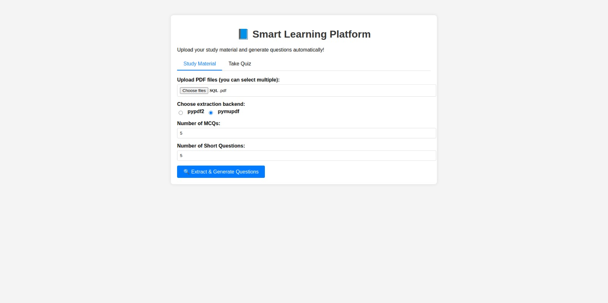
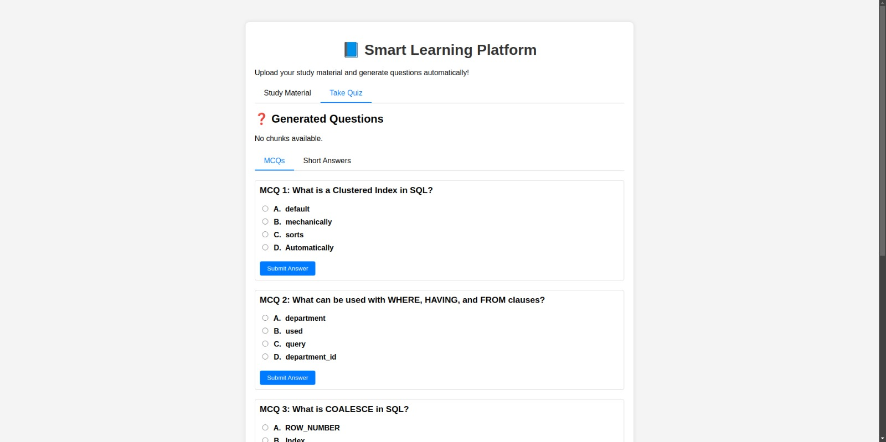
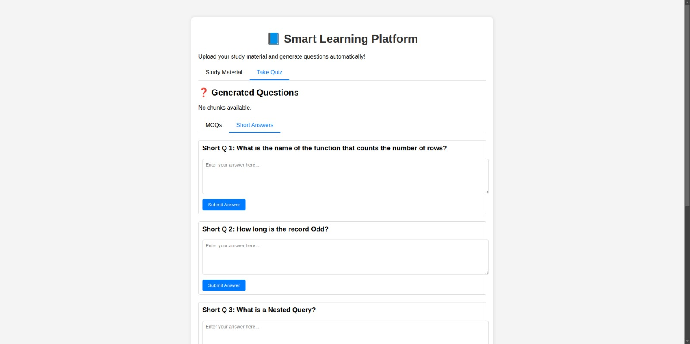

# 📘 Smart Learning Platform

An AI-powered educational tool that automatically generates Multiple Choice Questions (MCQs) and Short Answer questions from PDF documents. This platform leverages advanced Natural Language Processing (NLP) models to extract text, generate high-quality questions, and evaluate student responses.





## 🚀 Features

### Core Functionality
- **PDF Text Extraction**: Advanced text extraction from PDF files using PyMuPDF with noise filtering and OCR artifact removal
- **Question Generation**:
  - Multiple Choice Questions (MCQs) with distractor generation
  - Short Answer questions with context-aware answer generation
- **Intelligent Evaluation**: Semantic similarity-based evaluation for short answers using Sentence Transformers
- **Web Interface**: Modern, responsive web application built with Flask

### AI Models Used
- **T5 (Text-to-Text Transfer Transformer)**: For question generation from text highlights
- **BART (Bidirectional and Auto-Regressive Transformers)**: For answer generation and text summarization
- **Sentence Transformers (SBERT)**: For semantic similarity and distractor generation
- **FAISS**: Efficient similarity search for Retrieval-Augmented Generation (RAG)

### Advanced Features
- **Text Chunking with Overlap**: Intelligent text segmentation for better context preservation
- **Quality Filtering**: Multiple validation filters to ensure question quality
- **Real-time Progress Tracking**: Upload progress and generation status updates
- **Interactive Quiz Interface**: Tabbed interface for question types with immediate feedback

## 🛠️ Installation

### Prerequisites
- Python 3.8 or higher
- pip package manager

### Setup Instructions

1. **Clone the repository**:
   ```bash
   git clone https://github.com/Abhinayr006/Automated-QA-Generation.git
   cd Automated-QA-Generation
   ```

2. **Create a virtual environment** (recommended):
   ```bash
   python -m venv venv
   source venv/bin/activate  # On Windows: venv\Scripts\activate
   ```

3. **Install dependencies**:
   ```bash
   pip install -r requirements.txt
   ```

4. **Download NLTK data** (required for text processing):
   ```python
   import nltk
   nltk.download('punkt')
   nltk.download('stopwords')
   nltk.download('wordnet')
   nltk.download('averaged_perceptron_tagger_eng')
   ```

## 📋 Dependencies

The project uses the following key libraries:

- **Flask**: Web framework for the application
- **transformers**: Hugging Face transformers for NLP models
- **torch**: PyTorch for deep learning computations
- **sentence-transformers**: For semantic text embeddings
- **pymupdf**: PDF text extraction
- **faiss-cpu**: Vector similarity search
- **scikit-learn**: Machine learning utilities
- **nltk**: Natural language processing toolkit
- **numpy**: Numerical computing
- **pandas**: Data manipulation
- **textblob**: Text processing utilities

## 🚀 Usage

### Running the Application

1. **Start the Flask server**:
   ```bash
   python run.py
   ```

2. **Open your browser** and navigate to `http://localhost:5000`

### How to Use

1. **Upload Study Material**:
   - Click on the "Study Material" tab
   - Select one or more PDF files
   - Specify the number of MCQs and Short Answer questions to generate
   - Click "Extract & Generate Questions"

2. **Take the Quiz**:
   - Switch to the "Take Quiz" tab
   - Answer MCQs by selecting options and clicking "Submit Answer"
   - For Short Answer questions, type your response and submit for evaluation

3. **View Results**:
   - MCQs provide immediate correct/incorrect feedback
   - Short Answer questions show similarity percentage and correct answer

## 📁 Project Structure

```
smart-learning-platform/
├── run.py                          # Main Flask application
├── requirements.txt                # Python dependencies
├── .gitignore                      # Git ignore rules
├── README.md                       # Project documentation
├── src/
│   ├── preprocessing/
│   │   ├── extract_text.py         # PDF text extraction utilities
│   │   └── __init__.py
│   └── question_generation/
│       ├── enhanced_mcq.py         # Enhanced MCQ generation
│       ├── mcq.py                  # Basic MCQ generation
│       ├── short.py                # Short answer question generation
│       ├── filters.py              # Question quality filters
│       ├── highlight.py            # Text highlighting utilities
│       └── __init__.py
├── static/
│   ├── css/
│   │   └── styles.css              # Application styling
│   └── js/
│       └── script.js               # Frontend JavaScript
└── templates/
    └── index.html                  # Main HTML template
```

## 🔧 Configuration

### Model Configuration
The application uses pre-trained models that are automatically downloaded on first run:
- T5-base QG model: `valhalla/t5-base-qg-hl`
- BART Large: `facebook/bart-large`
- SBERT: `sentence-transformers/all-mpnet-base-v2`

### Performance Tuning
- **GPU Support**: Models automatically use CUDA if available
- **Batch Processing**: Efficient text processing with configurable chunk sizes
- **Memory Management**: Optimized for both CPU and GPU environments

## 🤝 Contributing

1. Fork the repository
2. Create a feature branch (`git checkout -b feature/AmazingFeature`)
3. Commit your changes (`git commit -m 'Add some AmazingFeature'`)
4. Push to the branch (`git push origin feature/AmazingFeature`)
5. Open a Pull Request


## 🙏 Acknowledgments

- Hugging Face for providing pre-trained NLP models
- The open-source community for the amazing libraries used in this project
- Research papers on Question Generation and Answer Evaluation techniques

## 📞 Support

If you encounter any issues or have questions:
1. Check the existing issues on GitHub
2. Create a new issue with detailed information
3. Include error messages, Python version, and steps to reproduce

---

**Note**: This application requires significant computational resources for model inference. GPU acceleration is recommended for better performance.
